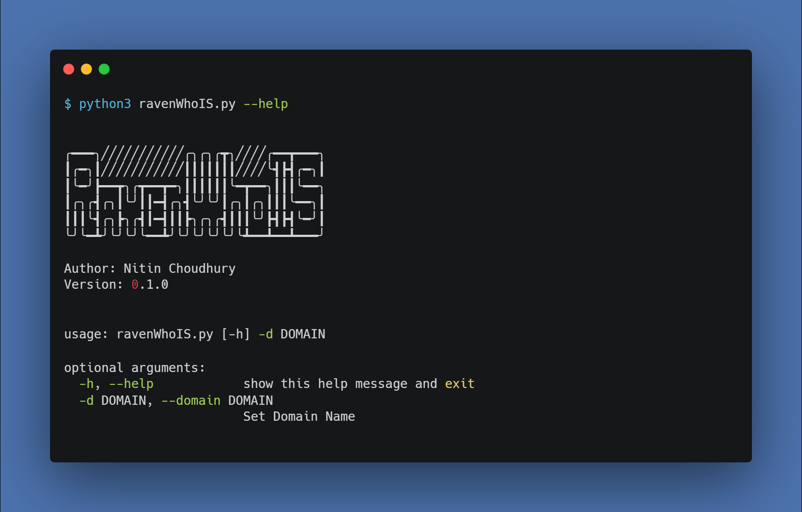
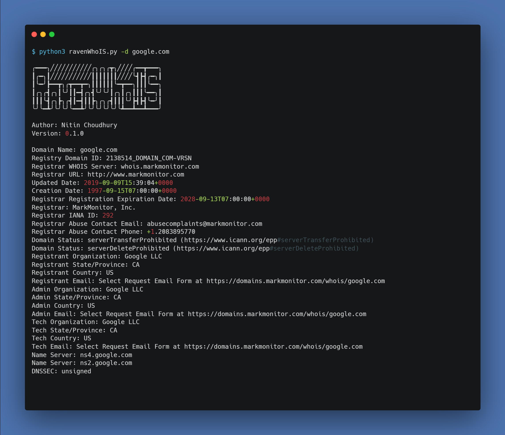

# RavenWhoIS
RavenWhoIS is a python based tool for gathering WhoIS information of a particular domain/IP.

# Uses
```
python3 ravenWhoIS.py --help
```


```
python3 ravenWhoIS.py -d google.com
```
